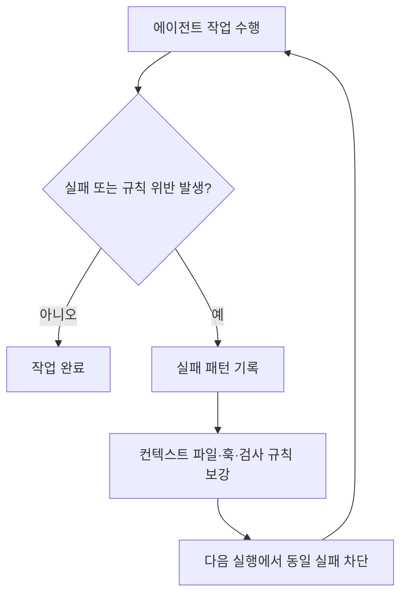

# Harness Engineering

하네스 엔지니어링은 AI 에이전트가 한 번 저지른 실수를 다시 반복하지 못하도록, 모델 바깥의 실행 환경을 구조적으로 설계하는 접근이다. 이 문맥에서 하네스는 프롬프트 보강을 넘어 `CLAUDE.md`, `AGENTS.md`, MCP, 스킬, 훅, 린터, 자동 검사 루프 같은 비모델 레이어를 포함한다.

## 정의

- 좁게는 에이전트의 반복 실패를 재발 불가능한 구조로 바꾸는 엔지니어링이다.
- 넓게는 모델이 더 안정적으로 일하도록 실행 경계, 문서, 도구, 검증 루프를 설계하는 운영 체계다.
- 핵심 구분은 **프롬프트는 부탁이고, 하네스는 강제**라는 점이다.

## 왜 필요한가

하네스 엔지니어링은 두 가지 문제를 겨냥한다.

1. **컨텍스트 부패**: 긴 작업에서 앞선 맥락을 잊거나, 절반 구현 후 중단하거나, 너무 일찍 완료를 선언하는 문제.
2. **규칙 부재**: 해서는 안 되는 행동을 설명으로만 전달해 실제 실행 단계에서 차단하지 못하는 문제.

즉, 모델의 지능 부족보다 실행 환경의 통제 부재를 주요 병목으로 본다.

## 세 가지 기둥

### 1. 컨텍스트 파일

- 새 세션마다 다시 읽히는 프로젝트 지침서 역할을 한다.
- 긴 설명서보다 반복적으로 항상 적용되는 규칙과 지도 성격의 정보가 중요하다.
- 실패할 때마다 한 줄씩 보강하는 방식이 실용적이다.

### 2. 자동 강제 시스템

- 린터, 프리커밋 훅, 타입 검사, 테스트 게이트가 여기에 속한다.
- 규칙 위반을 “하지 말라”는 문장이 아니라 “통과하지 못하면 다음 단계로 못 가는 구조”로 바꾼다.
- 성공 신호는 조용하게, 실패 신호만 에이전트에게 돌려주는 방식이 컨텍스트 낭비를 줄인다.

### 3. 가비지 컬렉션

- 나쁜 패턴이 코드베이스에 쌓이면 에이전트가 그것을 학습·모방하므로, 주기적 청소가 필요하다.
- 문서-코드 불일치, 규칙 위반 코드, 미사용 코드 같은 누적 오염을 줄이는 역할이다.

## 작동 흐름

## 실무적 해석

- 하네스의 목적은 모델을 약하게 만드는 것이 아니라, 모델의 출력을 더 예측 가능하고 재현 가능하게 만드는 것이다.
- 모델 자체를 교체하지 않아도 하네스 개선만으로 에이전트 성능이 크게 달라질 수 있다.
- 아이디어가 아직 흐릴 때는 하네스를 과하게 설계하기보다 먼저 빠르게 만들어 보고, 실패 패턴이 확인되면 하네스를 강화하는 순서가 더 적절하다.

## 현재 소스 기준 정리

이 개념 페이지는 [[2026-04-05 Harness Engineering Complete Guide]]를 바탕으로 작성되었다. 해당 소스는 하네스를 다음과 같이 해석한다.

- 하네스의 범위는 모델 외부의 거의 모든 운영 장치다.
- 하네스 개선은 반복 실패를 새로운 규칙으로 흡수하는 점진적 진화 과정이다.
- 장기적으로는 개발자의 역할이 코드 직접 작성에서, 에이전트가 올바르게 일하도록 환경을 설계하는 방향으로 이동한다고 본다.

## 출처

- [[2026-04-05 Harness Engineering Complete Guide]]
