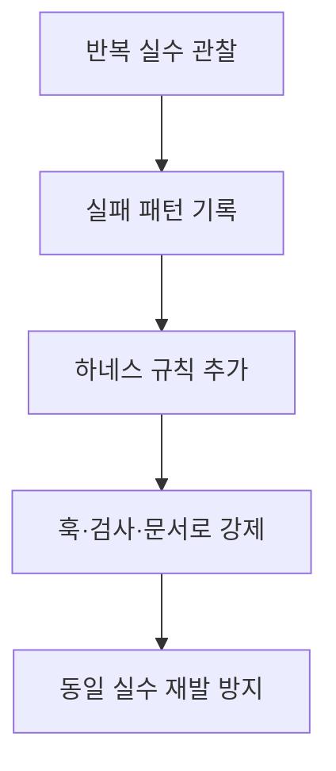

# 2026-04-05 Harness Engineering Complete Guide

## 메타데이터

- 원문: [하네스 엔지니어링 완전 정복: AI 에이전트를 길들이는 구조 설계](https://gyuha.com/post/2026/04/2026-04-05-harness-engineering-complete-guide/)
- 발행일: 2026-04-05
- raw: `raw/inbox/2026-04-05-harness-engineering-complete-guide.md`
- 관련 개념: [[Harness Engineering]]

## 요약

이 글은 AI 코딩 에이전트의 반복 실수, 컨텍스트 소진, 규칙 위반을 다루기 위한 운영 설계 개념으로 [[Harness Engineering]]을 소개한다. 핵심 주장은 프롬프트만으로는 반복 실패를 막을 수 없고, `CLAUDE.md`, `AGENTS.md`, MCP, 스킬, 훅 같은 비모델 레이어를 구조적으로 설계해야 한다는 것이다.

## 핵심 주장

- 하네스는 모델 자체가 아니라 모델을 둘러싼 실행 환경 전체를 뜻한다.
- AI 활용은 프롬프트 엔지니어링 → 컨텍스트 엔지니어링 → MCP/스킬 → 하네스 엔지니어링으로 진화했다.
- 하네스가 해결하는 핵심 문제는 컨텍스트 부패와 규칙/울타리의 부재다.
- 프롬프트는 부탁이지만 하네스는 강제다. 반복 실수를 금지 문장으로 줄이는 대신, 실수 자체가 일어나지 않게 구조를 만든다.
- 핵심 구성은 컨텍스트 파일, 자동 강제 시스템, 가비지 컬렉션으로 정리된다.
- 모델 교체 없이도 하네스 개선만으로 에이전트 성능이 크게 향상될 수 있다는 사례를 제시한다.

## 구조 메모

## 실무 포인트

- 새 세션에서도 다시 읽히는 컨텍스트 파일이 컨텍스트 부패를 완화한다.
- 프리커밋 훅, 린터, 자동 교정 루프는 규칙 위반을 사후 설명이 아니라 사전 차단으로 바꾼다.
- 하네스는 처음부터 완벽하게 설계하기보다, 실제 실패 사례를 누적해 점진적으로 강화하는 방식이 적절하다.

## 출처 연결

- 개념 정리: [[Harness Engineering]]
- 원문 보관: `raw/inbox/2026-04-05-harness-engineering-complete-guide.md`
